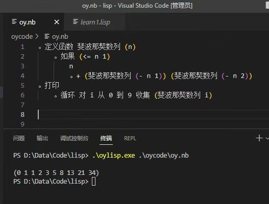

# 一些改变世界的想法

## 1.[数字收藏链](./数字收藏链.md)

构建一个基于贡献的区块链网络，成为一个永久且免费的知识服务平台。

提供优质数字藏品、提供网络服务、邀约新人加入并且新人服务他人，这些行为都是服务他人的行为，都能为你带来收益。

每个人通过服务他人以及邀约新人来获得货币。和区块链货币一样，数字收藏货币也可以交易。每个人在网络中分享自己的数字藏品，当你浏览数字藏品时，你可以赞同它或购买下载它。保存一份数字藏品并为购买它的人提供下载服务，服务者和分享者都能获得收益。新人开户需要上传自己的人脸特征，用3D人脸视频及其md5证明这是自己，其他人可以验证这是一个真实的人类产生的数据。新人给邀约者带来的收益是有上限的。

## 2.电子宠物
2022年chatGPT展现出惊人能力。以目前机器人的发展，我预言接入AI能力的小型、灵巧、可爱、聪明的电子宠物会爆火。

想想，如果一只毛茸茸、灵动可爱的电子狗狗，不用担心它拆家，不需要为它铲屎，也不用担心他太脏以至于经常清洗。甚至都不需要喂食，让它自己去充电就行。而且这种电子狗还拥有聪明的大脑，能听懂你的意思，记住与你有关的一切。如果需要，甚至可以让它开口说话。

我认为这样比猫猫狗狗更聪明的电子宠物会优于普通的生物宠物，他们会比传统宠物更能提供情感价值。

## 3.编程语言的想法
lisp语言是具备最多编程思想、功能最为强大的编程语言。但因为使用难度高、运行效率不高等问题，并没有太多人使用它。

作为中国人，我希望有一款使用中文编程，并且功能强大，能够使用代码修改代码，有代码即数据思想的编程语言。于是我看上了lisp，基于lisp语言做改造，用缩进和中文句号来标识语法结构，跟小括号一样清晰，并且比小括号更方便查看抽象语法树的结构。



语法改造很简单，每一个中文句号都代表一个s-express，由 **“。”** 开始，最后一个缩进行结束。你同样可以使用中英文小括号（）来写表达式，这是兼容的。如上图中， **“。定义函数···”** 是开始，它的lisp语言是 **“(定义函数···”**。结束的位置是 **“。+ (斐波那契数列···”**，转换为lisp语言则是在末尾添加了一个 **“)”**。这种语法和python是一样的。翻译成lisp语言是这样的：

```lisp
(定义函数 斐波那契数列 (n)
    (如果 (<= n 1)
        n
        (+ (斐波那契数列 (- n 1) (斐波那契数列(- n 2))))))
(打印 (循环 对 i 从 0 到 9 手机 (斐波那契数列 i)))
```
除了这些能力，我还希望加入类似unity Editor编辑器扩展的功能。

unity的编辑器扩展可以让我们使用C#脚本来修改控制unity的游戏对象。oylisp有数据即代码的思想，那么我们可以使用oylisp脚本作为扩展来修改和控制oylisp代码，相当于我在开发程序的同时，还会不断地开发我们的编辑器。

从全局最优的角度来看，世界上并不需要那么多高级编程语言。多数高级编程语言都能由lisp方言演变过去。但可惜，人类并不能凝聚为一个整体，我们必然做不到全局最优。

现在，我怀疑冯诺依曼架构计算机的编程语言快到尽头了。lisp的设计思想是冯诺依曼架构计算机编程语言的终极形态，主流语言python已经非常接近。chatGPT让我们看见了自然语言编程的曙光。新时代的编程语言可能是自然语言，计算机必然要设计出适合大语言模型工作的硬件。

## 4.强人工智能
1.
人们已经从生物身上学到了非常多灵感，并通过计算机来实现他们。神经网络、深度学习、强化学习。他们给我一种感觉，似乎把目前主流的各种AI技术结合在一起，打通任督二脉，一个像人一样能够自主学习的AI可以诞生。

可惜目前的AI都有一个通病：还没有与环境交互的能力。不能像人一样去触摸自然，通过反馈来思考世界的规律。强化学习虽然与环境交互，但是交互成本高昂。

我认为深度学习是AI思考的过程，毛病是没法自动进行反馈闭环。目前的闭环都是人工在喂数据和微调。
而强化学习则是AI与环境交互，产生闭环反馈的过程。但可惜，强化学习没脑子，只是在积累最表面的经验。
深度学习和强化学习相结合，并赋予一个和大自然接触的身体，才是一个有可能实现智能的AI。

2.
另一种我认为实现能自主学习有自我意识的AI的办法是，从简单的开始研究。如果真的存在强AI的程序，它就是段01代码。而我们则是需要在一个庞大的解空间中找到它。未完待续···
